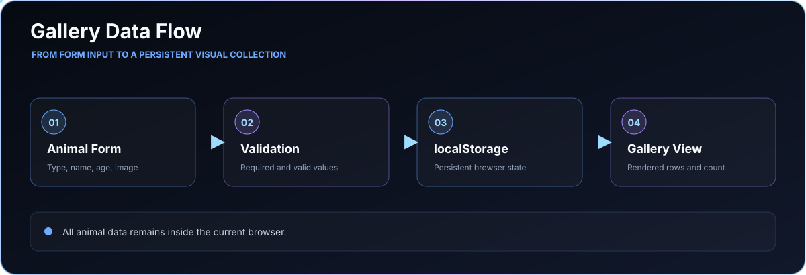

<p align="center">
  
</p>

<p align="center">
  <a href="https://itaygoldenberg.github.io/Animal-Gallery-Manager/"></a>
  <a href="https://github.com/itaygoldenberg/Animal-Gallery-Manager"></a>
  <a href="https://www.linkedin.com/in/itay-goldenberg/"></a>
</p>

<p align="center">
  <a href="#overview">Overview</a>&nbsp;&middot;&nbsp;
  <a href="#features">Features</a>&nbsp;&middot;&nbsp;
  <a href="#workflow">Workflow</a>&nbsp;&middot;&nbsp;
  <a href="#technology">Technology</a>&nbsp;&middot;&nbsp;
  <a href="#running-locally">Local setup</a>
</p>

> [!NOTE]
> A vanilla JavaScript practice project focused on validated input, dynamic rendering and browser persistence.

## Overview

Animal Gallery Manager is a focused browser application for building a visual collection of animals. Each entry combines a type, name, age and image URL, then becomes a structured gallery record.

The entire workflow runs in the browser: JavaScript validates the form, renders the collection and synchronizes it with localStorage so the gallery survives refreshes and future visits.

<table><tr><td align="center" width="25%"><strong>5</strong><br /><sub>animal types</sub></td><td align="center" width="25%"><strong>URL</strong><br /><sub>image input</sub></td><td align="center" width="25%"><strong>LIVE</strong><br /><sub>item count</sub></td><td align="center" width="25%"><strong>LOCAL</strong><br /><sub>saved gallery</sub></td></tr></table>

| Project detail | Implementation |
|---|---|
| Collection | Cats, dogs, fish, rabbits and birds |
| Validation | Required fields, age and image URL checks |
| Rendering | Dynamic table rows with images and details |
| Persistence | Browser localStorage with no remote database |

## Contents

- [Overview](#overview)
- [Features](#features)
- [Workflow](#workflow)
- [Technology](#technology)
- [Project structure](#project-structure)
- [Running locally](#running-locally)
- [Operational notes](#operational-notes)
- [Author](#author)

## Features

### Guided entry workflow

The form captures the animal type, name, age and image URL. Invalid or incomplete entries are rejected before they reach the collection.

### Dynamic gallery

Every saved animal is rendered immediately with its visual identity and details. Entries can be removed individually and the collection count updates with the state.

### Browser persistence

The gallery is serialized to `localStorage`. It remains available after a refresh or browser restart without requiring an account, backend or database.

## Workflow

<p align="center">
  
</p>

## Technology

<p align="center">
  
</p>

| Technology | Role |
|---|---|
| HTML5 | Accessible form and gallery structure |
| CSS3 | Responsive layout and visual presentation |
| JavaScript | Validation, state updates and DOM rendering |
| Web Storage API | Persistent browser-side collection |

## Project structure

```text
Animal-Gallery-Manager/
|-- index.html     Application markup
|-- style.css      Layout and visual presentation
|-- main.js        Validation, storage and rendering
|-- docs/          README-only visual assets
`-- README.md      Project documentation
```

## Running locally

No installation is required.

```bash
git clone https://github.com/itaygoldenberg/Animal-Gallery-Manager.git
cd Animal-Gallery-Manager
```

Open `index.html` directly or serve the folder with VS Code Live Server.

## Operational notes

- Saved animals belong to the current browser profile.
- Clearing site storage also clears the gallery.

## Author

<p align="center">
  <strong>Itay Goldenberg</strong><br />
  Full Stack Developer Student
</p>

<p align="center">
  <a href="https://github.com/itaygoldenberg"></a>
  <a href="https://www.linkedin.com/in/itay-goldenberg/"></a>
</p>
